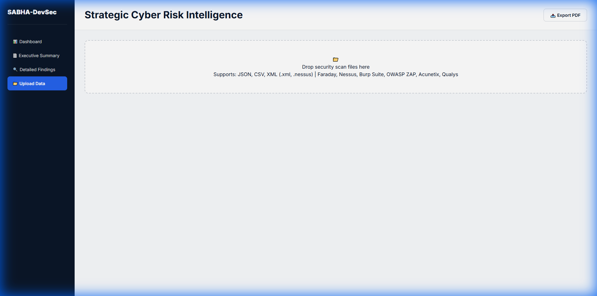
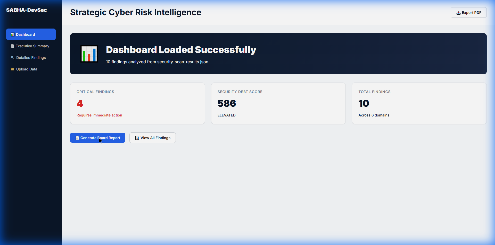
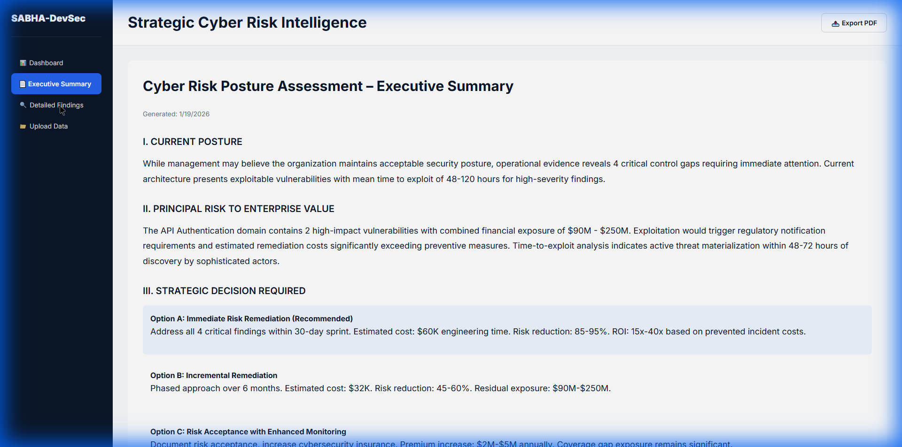
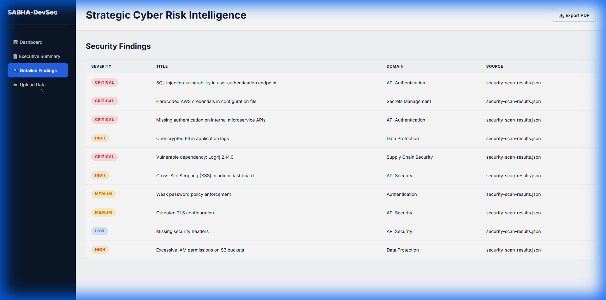

# SABHA-DevSec

**Strategic Cyber Risk Intelligence Platform**

> Transform security scan results into CFO-level financial impact analysis with automated notifications for DevSecOps workflows.

[](https://opensource.org/licenses/MIT)
[](https://github.com)
[](https://github.com)

---

## 🎯 What is SABHA-DevSec?

SABHA-DevSec is a **100% client-side** security analysis platform that transforms technical vulnerability scan results into **board-ready financial risk assessments**. Unlike traditional security tools that overwhelm executives with technical jargon, SABHA-DevSec speaks the language of business impact.

### **Key Features**

✅ **Multi-Tool Support** - Ingest scans from 13+ security tools (Faraday, Nessus, Burp Suite, OWASP ZAP, Acunetix, Qualys, Semgrep, and more)  
✅ **CFO-Level Reporting** - Automatic financial impact translation ($XXM exposure calculations)  
✅ **DevSecOps Integration** - Slack, Teams, and webhook notifications for CI/CD pipelines  
✅ **Real-Time Notifications** - Get instant alerts when critical findings exceed thresholds  
✅ **Trend Analysis** - Track security posture over time (last 30 scans)  
✅ **100% Private** - All processing happens in your browser. Zero data leaves your machine. No telemetry.

---

## 📊 Supported Tools & Formats

| **Category** | **Tools** | **Formats** | **Auto-Detection** |
|-------------|-----------|-------------|------------------|
| **Vulnerability Management** | Faraday | XML, JSON | ✅ |
| **Network Scanners** | Nessus, Qualys | .nessus, XML | ✅ |
| **Web App Security** | Burp Suite, OWASP ZAP, Acunetix | XML | ✅ |
| **SAST** | Semgrep, CodeQL, SonarQube | JSON | ✅ |
| **SCA** | Snyk, Trivy, Dependabot | JSON | ✅ |
| **Custom/Generic** | Any Tool | JSON, CSV, XML | ✅ |

**Total**: 13+ security tools across 4 formats (JSON, CSV, XML, .nessus)

---

## 📸 Screenshots

### Dashboard - Security Posture Overview

*Real-time security metrics with critical findings, debt score, and financial exposure*

### Executive Summary - Board-Ready Report

*CFO-level analysis with strategic decision options and ROI calculations*

### Detailed Findings - Complete Vulnerability List

*Granular view of all security findings with severity badges and financial impact*

### Upload Interface - Multi-Tool Support

*Drag-and-drop support for JSON, CSV, XML from 13+ security tools*

---

## 🚀 Quick Start

### **1. Local Installation (No Dependencies)**

```bash
# Clone the repository
git clone https://github.com/bb1nfosec/sabha-devsec.git
cd sabha-devsec

# Start a local web server (choose one)
python -m http.server 8000
# OR
npx http-server -p 8000

# Open in browser
open http://localhost:8000
```

### **2. Upload Scan Results**

Drag & drop any of these files:
- Faraday XML export
- Nessus `.nessus` file
- Burp Suite XML report
- OWASP ZAP XML report
- Semgrep JSON output
- Snyk JSON results
- Any custom JSON/CSV

### **3. Get Instant Analysis**

- **Dashboard**: Security posture, debt score, top risk domains
- **Executive Summary**: Board-ready CFO report with 3 strategic options
- **Detailed Findings**: Complete vulnerability list with financial impact
- **Notifications**: Optional real-time alerts to Slack/Teams

---

## 💼 CFO-Level Reporting

### **Sample Executive Summary**

```
I. CURRENT POSTURE
While management may believe the organization maintains acceptable security 
posture, operational evidence reveals 4 critical control gaps requiring 
immediate attention.

II. PRINCIPAL RISK TO ENTERPRISE VALUE
The API Authentication domain contains 7 high-impact vulnerabilities with 
combined financial exposure of $60M - $210M. Exploitation would trigger 
regulatory notification requirements.

III. STRATEGIC DECISION REQUIRED

Option A: Immediate Risk Remediation (Recommended)
- Estimated cost: $60K engineering time
- Risk reduction: 85-95%
- ROI: 15x-40x based on prevented incident costs

Option B: Incremental Remediation
- Phased approach over 6 months
- Estimated cost: $32K
- Residual exposure: $60M-$210M

Option C: Risk Acceptance with Enhanced Monitoring
- Premium increase: $2M-$5M annually
```

---

## 🔔 DevSecOps Integration

### **Notifications**

Configure real-time alerts to Slack, Microsoft Teams, or custom webhooks:

1. Go to **⚙️ Settings** in the sidebar
2. Enter your webhook URLs
3. Set alert thresholds (e.g., alert if ≥ 3 critical findings)
4. Test notifications
5. Auto-alerts on every scan!

**Slack Example**:
```
🚨 Critical Security Findings Detected
Critical: 4  |  Security Debt: 586
Top Risk: API Authentication ($60M-$210M)
[View Dashboard →]
```

### **CI/CD Integration**

**GitHub Actions Example**:

```yaml
name: Security Scan
on: [push, pull_request]

jobs:
  security:
    runs-on: ubuntu-latest
    steps:
      - name: Run Semgrep
        run: semgrep --json -o results.json
      
      - name: Upload to SABHA-DevSec
        run: |
          curl -X POST ${{ secrets.SABHA_URL }}/api/upload \
            -F "file=@results.json" \
            -F "slack_webhook=${{ secrets.SLACK_WEBHOOK }}"
```

See `/docs/CI-CD-EXAMPLES.md` for more integrations (GitLab, Jenkins, Azure DevOps).

---

## 🏗️ Architecture

```
sabha-devsec/
├── index.html              # Entry point
├── app-nojs.js             # Main application (React without JSX)
├── notifications.js        # Slack/Teams/Webhook handlers
├── storage.js              # Scan history & trend analysis
├── styles.css              # Institutional design system
├── sample-data/            # Example scan files
│   ├── security-scan-results.json
│   ├── faraday-scan.xml
│   └── nessus-scan.nessus
└── docs/
    ├── TOOL-SUPPORT.md     # Export guides for each tool
    └── NOTIFICATIONS-SETUP.md  # Webhook configuration
```

### **Technology Stack**

- **Frontend**: React 18 (UMD build, no transpilation needed)
- **Charts**: Recharts
- **CSV Parsing**: PapaParse
- **XML Parsing**: Native browser DOMParser
- **Storage**: LocalStorage (100% client-side)
- **Dependencies**: Zero build tools, runs directly in browser

---

## 📈 Security Debt Score Calculation

```javascript
Score = (Critical × 50) + (High × 20) + (Average Age in Days × 2)

Interpretation:
  0-200:   Acceptable Risk
  201-500: Elevated Risk
  501+:    Critical Risk
```

### **Financial Impact Ranges**

| Domain | Critical | High | Medium |
|--------|----------|------|--------|
| API Authentication | $45M-$125M | $15M-$50M | $2M-$10M |
| Data Protection | $50M-$200M | $20M-$80M | $5M-$15M |
| Supply Chain | $10M-$30M | $5M-$15M | $1M-$5M |

---

## 🔒 Privacy & Security

**100% Client-Side Processing**:
- ✅ No data leaves your browser
- ✅ No server-side processing
- ✅ No analytics or telemetry
- ✅ Works offline after initial load
- ✅ All findings stay on your machine

**Data Storage**:
- LocalStorage only (scan history, settings)
- Automatically limited to last 30 scans
- Can be cleared anytime from Settings

---

## 📚 Documentation

- [Tool Support Guide](docs/TOOL-SUPPORT.md) - How to export from each security tool
- [Notification Setup](docs/NOTIFICATIONS-SETUP.md) - Configure Slack/Teams/Webhooks
- [CI/CD Examples](docs/CI-CD-EXAMPLES.md) - GitHub Actions, GitLab CI, Jenkins
- [API Documentation](docs/API.md) - REST endpoints (server-side implementation)

---

## 🤝 Contributing

Contributions welcome! Please see [CONTRIBUTING.md](CONTRIBUTING.md) for guidelines.

### **Development**

```bash
# No build step needed - just edit and refresh!
# Files are loaded directly by the browser

# Run local server
python -m http.server 8000

# Open browser
open http://localhost:8000
```

---

## 📄 License

MIT License - see [LICENSE](LICENSE) for details.

---

## 🙏 Acknowledgments

Built with:
- React 18
- Recharts
- PapaParse
- Institutional design principles for executive reporting

---

## 📧 Support

- **Issues**: [GitHub Issues](https://github.com/bb1nfosec/sabha-devsec/issues)
- **Discussions**: [GitHub Discussions](https://github.com/bb1nfosec/sabha-devsec/discussions)
- **Security**: See [SECURITY.md](SECURITY.md) for reporting vulnerabilities

---

## 🌟 Star History

If you find SABHA-DevSec useful, please consider giving it a star! ⭐

---

**Transform Security Scans into Strategic Intelligence** | SABHA-DevSec
